# 一、环境配置

github链接 ：[ultralytics/yolov5: YOLOv5 🚀 in PyTorch > ONNX > CoreML > TFLite (github.com)](https://github.com/ultralytics/yolov5)


```git
git clone https://github.com/ultralytics/yolov5.git
```


项目下载完成之后，下载三方库：

```
pip install -r requirements.txt
```


直接测试是否可以正常运行：

运行项目下的detect.py

如果没装cuda，不想用gpu训练，在train的436行改为cpu。那些报错cuda的同学，要么是没有cuda，要么版本不匹配


运行完成之后，在runs/detect/exp下面就会出现两张处理好了的图片。


到这一步只代表你环境没问题，建议进行运行。

coco128数据集下载:https://www.kaggle.com/datasets/ultralytics/coco128

下载需要谷歌账户登录


我下载好了，解压后：

网盘地址：

```python
链接：https://pan.baidu.com/s/1unMZcpDDYTuWnyqlbHGlgw?pwd=mwj6 
提取码：mwj6
```

下好的数据集应该是如下图所示


放的是我们要训练的图片，labels文件夹里存放的是打过标签的图片

目标检测需要手动进行打标签，这个我会在后面介绍使用自己数据集时进行详细介绍

在yolov5根目录下新建一个名为datasets的文件夹，再把coco128.zip解压到这个文件夹下。

如下图所示、


### 进行训练

这里我们需要知道两个yaml文件

第一个是data文件夹下的coco128.yaml   数据集参数文件


打开这个文件如下图，这个文件里是我们需要更改训练集以及测试集路径的地方，下面的names是每一个标签，可以看到coco128数据集里的标签数量是非常大的，我们平时自己玩的时候一般不会用到这么多标签。

 ---  **路径默认**写一下


 接着我们需要了解的另一个文件是models文件夹下的从yolov5l到yolov5s的训练权重


 我们打开yolov5s这个文件，如下图。这里nc是我们的标签数量。

> 从./models目录下选择一个模型的配置文件，这里我们选择yolov5s.ymal，这是一个最小最快的模型。关于其他模型之间的比较下面介绍。选择好模型之后，如果你使用的不是coco数据集进行训练，而是自定义的数据集，此时只需要修改*.yaml配置文件中的nc: 80参数和数据的类别列表


以上两个文件我们目前都不用改，只是了解一下方便我们后面使用自己数据集进行测试时讲解

接着我们打开根目录的train.py文件，找到parse_opt方法

--weights 初始训练权重

--cfg 模型参数位置

--data 数据集参数文件


标注“**修改处**”的，是**一定要修改的**；其他的注释是一些较为重要的参数，对于小白而言不改也可。具体修改的地方为**defalut**后

直接开始运行train.py


参数调一下，不然运行非常非常久


```python
    parser.add_argument('--epochs', type=int, default=10, help='total training epochs')
    parser.add_argument('--batch-size', type=int, default=2, help='total batch size for all GPUs, -1 for autobatch')
```


等他跑完，最后的结果在runs->train -> exp文件夹里面

这里有多少个exp文件都是`--batch-size`这个参数决定的

> --batch-size 批量大小：在机器学习和深度学习中，指每次迭代训练时所使用的样本数量。


训练参数

训练的更多可选参数：

--epochs：训练的epoch，默认值300
--batch-size：默认值16
--cfg：模型的配置文件，默认为yolov5s.yaml
--data：数据集的配置文件，默认为data/coco128.yaml
--img-size：训练和测试输入大小，默认为[640, 640]
--rect：rectangular training，布尔值
--resume：是否从最新的last.pt中恢复训练，布尔值
--nosave：仅仅保存最后的checkpoint，布尔值
--notest：仅仅在最后的epoch上测试，布尔值
--evolve：进化超参数（evolve hyperparameters），布尔值
--bucket：gsutil bucket，默认值''
--cache-images：缓存图片可以更快的开始训练，布尔值
--weights：初始化参数路径，默认值''
--name：如果提供，将results.txt重命名为results_name.txt
--device：cuda设备，例如：0或0,1,2,3或cpu，默认''
--adam：使用adam优化器，布尔值
--multi-scale：改变图片尺寸img-size +/0- 50%，布尔值
--single-cls：训练单个类别的数据集，布尔值

```shell
python detect.py --source inference/1_input/2_imgs --weights ./weights/yolov5s.pt --output inference/2_output/2_imgs
```


# 制作自己的数据集

https://github.com/wkentaro/labelme

## 下载标注工具

制作自己的数据集需要用到工具labelimg，直接在命令行输入下面这行代码进行下载

```shell
pip install labelimg -i https://pypi.tuna.tsinghua.edu.cn/simple
```


```shell
(yolo_target_detection) D:\Y_PythonProject\yolo_target_detection\yolov5>pip install labelimg -i https://pypi.tuna.tsinghua.edu.cn/simple
Looking in indexes: https://pypi.tuna.tsinghua.edu.cn/simple
Collecting labelimg
  Downloading https://pypi.tuna.tsinghua.edu.cn/packages/c5/fb/9947097363fbbfde3921f7cf7ce9800c89f909d26a506145aec37c75cda7/labelImg-1.8.6.tar.gz (247 kB)
     |████████████████████████████████| 247 kB 1.7 MB/s
Collecting pyqt5
  Downloading https://pypi.tuna.tsinghua.edu.cn/packages/ca/ac/596e8ca16fd0634542d874c0d79219fc527ea7de73a5000092f60ecbf6e9/PyQt5-5.15.10-cp37-abi3-win_amd64.whl (6.8 MB)
     |████████████████████████████████| 6.8 MB 3.2 MB/s
Collecting lxml
  Using cached https://pypi.tuna.tsinghua.edu.cn/packages/7a/2f/61afbbb627e910d83613f198ceea270376f6708f52a95b534db10c67b4eb/lxml-4.9.3-cp38-cp38-win_amd64.whl (3.9 MB)
Collecting PyQt5-Qt5>=5.15.2
  Downloading https://pypi.tuna.tsinghua.edu.cn/packages/37/97/5d3b222b924fa2ed4c2488925155cd0b03fd5d09ee1cfcf7c553c11c9f66/PyQt5_Qt5-5.15.2-py3-none-win_amd64.whl (50.1 MB)
     |████████████████████████████████| 50.1 MB 3.3 MB/s
Collecting PyQt5-sip<13,>=12.13
  Downloading https://pypi.tuna.tsinghua.edu.cn/packages/88/cd/dd21cdb92d053ca71c02c75ab7bd32874b82b33bef61d6d70b5d898e684b/PyQt5_sip-12.13.0-cp38-cp38-win_amd64.whl (78 kB)
     |████████████████████████████████| 78 kB 5.1 MB/s
Building wheels for collected packages: labelimg
  Building wheel for labelimg (setup.py) ... done
  Created wheel for labelimg: filename=labelImg-1.8.6-py2.py3-none-any.whl size=261521 sha256=9af8e53c439627878f475d986e06d1f353be6c4e6210f60229460e610f9f0374
  Stored in directory: c:\users\gamehaus\appdata\local\pip\cache\wheels\6e\a6\57\87059c70d0f25650e60d741c9815f089df3645aa8766a47b6c
Successfully built labelimg
Installing collected packages: PyQt5-sip, PyQt5-Qt5, pyqt5, lxml, labelimg
Successfully installed PyQt5-Qt5-5.15.2 PyQt5-sip-12.13.0 labelimg-1.8.6 lxml-4.9.3 pyqt5-5.15.10
WARNING: You are using pip version 21.1.2; however, version 23.3.1 is available.
You should consider upgrading via the 'D:\Z_Enviroment\python\yolo_target_detection\Scripts\python.exe -m pip install --upgrade pip' command.

```


检查是否安装成功，在控制台输入：

```shell
labelimg
```


## 创建对应文件夹

yolov5项目的文件夹同级建立一个新的文件夹MyData（名字可以自定义）

并在MyData文件夹下创建如下两个文件夹和一个predefined_classes.txt文件

```text
MyData:-|─ images：存储的是图片的名字
        ├─ labels ：用于存放标注图片的标签文件
        └─ predefined_classes.txt ： 定义自己要标注的所有类别
```


predefined_classes.txt是用来存放你的标签名称，我这里打三个标签分别是m_btn,c_btn,menu


接着，将你想要训练的图片放到images文件夹下（数据集100张以上才有一定效果，我这里拿105张图片作演示）

命令行转到MyData文件夹 

输入以下指令打开labelimg

```shell
labelimg images predefined_classes.txt
```

选择好标注数据文件夹之后，即进入到了LabelImg的界面，如下图：


- 最上方显示的是当前标注图片的路径
- Open Dir：待标注图片数据的路径文件夹，即选择images文件夹
- Change Save Dir：保存类别标签的路径文件夹，即选择labels文件夹
- PascalVOC：标注的标签保存成VOC格式，在鼠标点一下就变成YOLO，即此时就会把标注的标签变成YOLO格式

### 标注前先进行一些设置

点击View显示如下图，然后把如下的几个选项勾上：

- Auto Save mode：当你切换到下一张图片时，就会自动把上一张标注的图片标签自动保存下来，这样就不用每标注一样图片都按Ctrl+S保存一下了
- Display Labels：标注好图片之后，会把框和标签都显示出来
- Advanced Mode：这样标注的十字架就会一直悬浮在窗口，不用每次标完一个目标，再按一次W快捷键，调出标注的十字架。
  


### 开始打标

点击Change Save Dir选择MyData下的labels文件夹

点击SAVE下面的PascalVOC将其切换成yolo（如果刚开始不是yolo就切换成yolo，是的话就不用动）

点击Create RectBox开始画框（打标签）


 打完一张图片的标签可以按“D”键自动保存并进入下一张


标注常用的快捷键

- W：调出标注的十字架，开始标注
- A：切换到上一张图片
- D：切换到下一张图片
- Ctrl+S：保存标注好的标签
- del：删除标注的矩形框
- Ctrl+鼠标滚轮：按住Ctrl，然后滚动鼠标滚轮，可以调整标注图片的显示大小
- Ctrl+u：选择要标注图片的文件夹
- Ctrl+r：选择标注好的label标签存放的文件夹
- ↑→↓←：移动标注的矩形框的位置


我们可以在labels文件夹里看到自动生成的文件，classes是存放标签的文件。

上后面都是以图片名字命名的用来存放你在该图片中画框坐标位置的文件。


标注好了可以关闭LabelImg


## 开始训练

数据集准备好了，现在我们到之前提到的项目文件中

data/coco128.yaml，复制一个这个文件并改名成你自己喜欢的我这里起名mycoco.yaml


打开这个文件，修改path，train和val后的地址，path就是MyData文件地址，train是MyData文件下的images地址，val是测试集，由于我这里数据量较小我就都用images了，读者可以自行添加测试集，方法是在images和labels文件夹下分别创建train和test文件夹分别放入图片


 接着来到我们之前提到的models文件夹下的yolov5s.yaml文件

 复制该文件，并命名为myyolov5s.yaml，并打开，将nc修改为3（因为有三个标签）


 最后打开train.py,修改如下地址


运行train.py


等待训练结束后在runs/train文件夹中可以看到结果


best.pt和last.pt这些都是你训练好的模型权重，你可以理解为这就是你训练好的模型


best.pt是看起来最好的一次，last.pt是最后一次，虽然best是看起来最好的一次但是可能泛化能力不强，所以我这里选择last


我们回到detect.py中继续修改地址

这里--source后的地址要改成你在MyData文件夹下的test文件地址

--data后的地址改成data/myyolov5s.yaml

点击运行开始detect


结果存放在runs/detect/exp中，可以到这个文件夹查看，效果还行


```python
pip install efficientnet_pytorch
```


# efficientnet预训练模型下载地址


```python
https://github.com/pytorch/vision/tree/main/torchvision/models
```


EfficientNet_B0_Weights

源码地址

```python
https://github.com/pytorch/vision/blob/main/torchvision/models/efficientnet.py
```

下载地址

```python
https://download.pytorch.org/models/efficientnet_b0_rwightman-7f5810bc.pth
```


在yolov5中的README.md也有下载地址

```shell
[EfficientNet_b0]
https://github.com/ultralytics/yolov5/releases/download/v7.0/efficientnet_b0.pt
[EfficientNet_b1]
https://github.com/ultralytics/yolov5/releases/download/v7.0/efficientnet_b1.pt 
[EfficientNet_b2]
https://github.com/ultralytics/yolov5/releases/download/v7.0/efficientnet_b2.pt
[EfficientNet_b3]
https://github.com/ultralytics/yolov5/releases/download/v7.0/efficientnet_b3.pt)
```


输入地址可以直接下载：


# 修改为efficientnet训练


yolov5 -> models -> common.py

在代码最后面加上

```python
from efficientnet_pytorch import EfficientNet
'''
模型：efficientnet_v2_s
'''
"""
在ImageNet数据集上，EfficientNetV2-S达到了83.9%的精确度。
在ImageNet数据集上，EfficientNetV2-M达到了85.6%的精确度。
在ImageNet数据集上，EfficientNetV2-L达到了87.3%的精确度。
"""
from torchvision import models

class efficientnet_v2_s1(nn.Module):
    def __init__(self, ignore) -> None:
        super().__init__()
        model = models.efficientnet_v2_s()
        modules = list(model.children())
        modules = modules[0][:4]
        self.model = nn.Sequential(*modules)
    def forward(self, x):
        return self.model(x)

class efficientnet_v2_s2(nn.Module):
    def __init__(self, ignore) -> None:
        super().__init__()
        model = models.efficientnet_v2_s()
        modules = list(model.children())
        modules = modules[0][4:6]
        self.model = nn.Sequential(*modules)
    def forward(self, x):
        return self.model(x)

class efficientnet_v2_s3(nn.Module):
    def __init__(self, ignore) -> None:
        super().__init__()
        model = models.efficientnet_v2_s()
        modules = list(model.children())
        modules = modules[0][6:]
        self.model = nn.Sequential(*modules)
    def forward(self, x):
        return self.model(x)


'''
模型：efficientnet_b1
'''
class efficientnet_b11(nn.Module):
    def __init__(self, ignore) -> None:
        super().__init__()
        model = models.efficientnet_b1()
        modules = list(model.children())
        modules = modules[0][:4]
        self.model = nn.Sequential(*modules)
    def forward(self, x):
        return self.model(x)

class efficientnet_b12(nn.Module):
    def __init__(self, ignore) -> None:
        super().__init__()
        model = models.efficientnet_b1()
        modules = list(model.children())
        modules = modules[0][4:6]
        self.model = nn.Sequential(*modules)
    def forward(self, x):
        return self.model(x)

class efficientnet_b13(nn.Module):
    def __init__(self, ignore) -> None:
        super().__init__()
        model = models.efficientnet_b0()
        modules = list(model.children())
        modules = modules[0][6:]
        self.model = nn.Sequential(*modules)
    def forward(self, x):
        return self.model(x)


'''
模型：efficientnet_b0
'''
class efficientnet_b01(nn.Module):
    def __init__(self, ignore) -> None:
        super().__init__()
        model = models.efficientnet_b0()
        modules = list(model.children())
        modules = modules[0][:4]
        self.model = nn.Sequential(*modules)
    def forward(self, x):
        return self.model(x)

class efficientnet_b02(nn.Module):
    def __init__(self, ignore) -> None:
        super().__init__()
        model = models.efficientnet_b0()
        modules = list(model.children())
        modules = modules[0][4:6]
        self.model = nn.Sequential(*modules)
    def forward(self, x):
        return self.model(x)

class efficientnet_b03(nn.Module):
    def __init__(self, ignore) -> None:
        super().__init__()
        model = models.efficientnet_b0()
        modules = list(model.children())
        modules = modules[0][6:]
        self.model = nn.Sequential(*modules)
    def forward(self, x):
        return self.model(x)


'''
模型：mobilenet_v3_small
'''
class MobileNetV3s1(nn.Module):
    # out channel 24
    def __init__(self, ignore) -> None:
        super().__init__()
        model = models.mobilenet_v3_small(pretrained=True)
        modules = list(model.children())
        modules = modules[0][:4]
        self.model = nn.Sequential(*modules)

    def forward(self, x):
        return self.model(x)

class MobileNetV3s2(nn.Module):
    # out 48 channel
    def __init__(self, ignore) -> None:
        super().__init__()
        model = models.mobilenet_v3_small(pretrained=True)
        modules = list(model.children())
        modules = modules[0][4:9]
        self.model = nn.Sequential(*modules)

    def forward(self, x):
        return self.model(x)

class MobileNetV3s3(nn.Module):
    # out 576 channel
    def __init__(self, ignore) -> None:
        super().__init__()
        model = models.mobilenet_v3_small(pretrained=True)
        modules = list(model.children())
        modules = modules[0][9:]
        self.model = nn.Sequential(*modules)
    def forward(self, x):
        return self.model(x)


# ----------------------------------------efficientnetv2方法1-↑----------------------------------------------------------

# ----------------------------------------efficientnetv2方法2-↓---------------------------------------------------------
class EfficientNetV2S(nn.Module):
    def __init__(self, *args) -> None:
        super().__init__()
        model = models.efficientnet_v2_s(pretrained=True, progress=True)
        modules = list(model.children())
        if args[2] == -1:
            modules = modules[0][args[1]:]
        else:
            modules = modules[0][args[1]:args[2]]
        self.model = nn.Sequential(*modules)

    def forward(self, x):
        return self.model(x)


class EfficientNetV2L(nn.Module):
    def __init__(self, *args) -> None:
        super().__init__()
        model = models.efficientnet_v2_l(pretrained=True, progress=True)
        modules = list(model.children())
        if args[2] == -1:
            modules = modules[0][args[1]:]
        else:
            modules = modules[0][args[1]:args[2]]
        self.model = nn.Sequential(*modules)

    def forward(self, x):
        return self.model(x)


# Mobilenetv3Small
# ——————MobileNetV3——————

class h_sigmoid(nn.Module):
    def __init__(self, inplace=True):
        super(h_sigmoid, self).__init__()
        self.relu = nn.ReLU6(inplace=inplace)

    def forward(self, x):
        return self.relu(x + 3) / 6


class h_swish(nn.Module):
    def __init__(self, inplace=True):
        super(h_swish, self).__init__()
        self.sigmoid = h_sigmoid(inplace=inplace)

    def forward(self, x):
        return x * self.sigmoid(x)


class SELayer(nn.Module):
    def __init__(self, channel, reduction=4):
        super(SELayer, self).__init__()
        # Squeeze操作
        self.avg_pool = nn.AdaptiveAvgPool2d(1)
        # Excitation操作(FC+ReLU+FC+Sigmoid)
        self.fc = nn.Sequential(
            nn.Linear(channel, channel // reduction),
            nn.ReLU(inplace=True),
            nn.Linear(channel // reduction, channel),
            h_sigmoid()
        )

    def forward(self, x):
        b, c, _, _ = x.size()
        y = self.avg_pool(x)
        y = y.view(b, c)
        y = self.fc(y).view(b, c, 1, 1)  # 学习到的每一channel的权重
        return x * y


class conv_bn_hswish(nn.Module):
    """
    This equals to
    def conv_3x3_bn(inp, oup, stride):
        return nn.Sequential(
            nn.Conv2d(inp, oup, 3, stride, 1, bias=False),
            nn.BatchNorm2d(oup),
            h_swish()
        )
    """

    def __init__(self, c1, c2, stride):
        super(conv_bn_hswish, self).__init__()
        self.conv = nn.Conv2d(c1, c2, 3, stride, 1, bias=False)
        self.bn = nn.BatchNorm2d(c2)
        self.act = h_swish()

    def forward(self, x):
        return self.act(self.bn(self.conv(x)))

    def fuseforward(self, x):
        return self.act(self.conv(x))


class MobileNetV3(nn.Module):
    def __init__(self, inp, oup, hidden_dim, kernel_size, stride, use_se, use_hs):
        super(MobileNetV3, self).__init__()
        assert stride in [1, 2]

        self.identity = stride == 1 and inp == oup

        # 输入通道数=扩张通道数 则不进行通道扩张
        if inp == hidden_dim:
            self.conv = nn.Sequential(
                # dw
                nn.Conv2d(hidden_dim, hidden_dim, kernel_size, stride, (kernel_size - 1) // 2, groups=hidden_dim,
                          bias=False),
                nn.BatchNorm2d(hidden_dim),
                h_swish() if use_hs else nn.ReLU(inplace=True),
                # Squeeze-and-Excite
                SELayer(hidden_dim) if use_se else nn.Sequential(),
                # pw-linear
                nn.Conv2d(hidden_dim, oup, 1, 1, 0, bias=False),
                nn.BatchNorm2d(oup),
            )
        else:
            # 否则 先进行通道扩张
            self.conv = nn.Sequential(
                # pw
                nn.Conv2d(inp, hidden_dim, 1, 1, 0, bias=False),
                nn.BatchNorm2d(hidden_dim),
                h_swish() if use_hs else nn.ReLU(inplace=True),
                # dw
                nn.Conv2d(hidden_dim, hidden_dim, kernel_size, stride, (kernel_size - 1) // 2, groups=hidden_dim,
                          bias=False),
                nn.BatchNorm2d(hidden_dim),
                # Squeeze-and-Excite
                SELayer(hidden_dim) if use_se else nn.Sequential(),
                h_swish() if use_hs else nn.ReLU(inplace=True),
                # pw-linear
                nn.Conv2d(hidden_dim, oup, 1, 1, 0, bias=False),
                nn.BatchNorm2d(oup),
            )

    def forward(self, x):
        y = self.conv(x)
        if self.identity:
            return x + y
        else:
            return y

#chatgpt 方法，yolo.py貌似没有修改
class EfficientNetBackbone(nn.Module):
    def __init__(self, version='b0'):
        super(EfficientNetBackbone, self).__init__()
        self.body = EfficientNet.from_pretrained('efficientnet-b{}'.format(version))

    def forward(self, x):
        return self.body.extract_endpoints(x)
```


参考文章:

```python
https://blog.csdn.net/u014297502/article/details/128787707
```


修改yolo.py

在`elif m is Expand:`下面添加：

```python
        elif m is efficientnet_b01 or m is efficientnet_b02 or m is efficientnet_b03:
            c2 = args[0]
```


修改.yaml配置

yolov5sefficientb0.yaml

```ymal
# YOLOv5 🚀 by Ultralytics, AGPL-3.0 license

# Parameters
nc: 3  # number of classes
depth_multiple: 0.33  # model depth multiple
width_multiple: 0.50  # layer channel multiple
anchors:
  - [10,13, 16,30, 33,23]  # P3/8
  - [30,61, 62,45, 59,119]  # P4/16
  - [116,90, 156,198, 373,326]  # P5/32

# YOLOv5 v6.0 backbone
backbone:
# [from, number, module, args]
  [[-1, 1, efficientnet_b01, [40]],  # 0
   [-1, 1, efficientnet_b02, [112]],  # 1
   [-1, 1, efficientnet_b03, [1280]],  # 2
   [-1, 1, SPPF, [1024, 5]],  # 3
  ]


# YOLOv5 v6.0 head
head:
  [ [ -1, 1, Conv, [ 512, 1, 1 ] ],
    [ -1, 1, nn.Upsample, [ None, 2, 'nearest' ] ],
    [ [ -1, 1 ], 1, Concat, [ 1 ] ],  # cat backbone P4
    [ -1, 3, C3, [ 512, False ] ],  # 7

    [ -1, 1, Conv, [ 256, 1, 1 ] ],
    [ -1, 1, nn.Upsample, [ None, 2, 'nearest' ] ],
    [ [ -1, 0 ], 1, Concat, [ 1 ] ],  # cat backbone P3
    [ -1, 3, C3, [ 256, False ] ],  # 11 (P3/8-small)

    [ -1, 1, Conv, [ 256, 3, 2 ] ],
    [ [ -1, 7 ], 1, Concat, [ 1 ] ],  # cat head P4
    [ -1, 3, C3, [ 512, False ] ],  # 14 (P4/16-medium)

    [ -1, 1, Conv, [ 512, 3, 2 ] ],
    [ [ -1, 3 ], 1, Concat, [ 1 ] ],  # cat head P5
    [ -1, 3, C3, [ 1024, False ] ],  # 17 (P5/32-large)

    [ [ 11, 14, 17 ], 1, Detect, [ nc, anchors ] ],  # Detect(P3, P4, P5)
  ]
```

## yolov5训练时卡住0%解决方案


将train.py中的parse_opt方法的workers参数默认值改为0:

```python
parser.add_argument('--workers', type=int, default=0, help='max dataloader workers (per RANK in DDP mode)')
```


参数解释：

那么 "max dataloader workers per RANK" 就表示每个 GPU 可以使用的最大数据加载工作线程数。每个 GPU 都可能独立地加载和处理其自己的数据批次，允许整个系统更有效地利用资源和减少训练时间。

## WARNING  NMS time limit 0.900s exceeded

https://blog.csdn.net/baidu_39629638/article/details/128182056

其实原因来看，进行NMS的时间断点太长了，将阈值也调大

同时这个warning只会存在与前几轮，原因是模型加载同时模型还没有学到特征，进行模型推理速度太慢，训练几轮后，模型的提取特征能力增强，推理图片数据的性能自然会提升，警告也就消失了。


## 全是0

这是一个困扰我一周的bug，断断续续找了一周的问题，今天总算让我找出来问题所在了！

首先，如果你的yolov5在训练的时候出现这种情况：

labels = 0；

只有obj loss，cls loss和reg loss皆为0？

那么说明肯定出现了我所说的这个bug，建议可以试一试我的办法，先说解决办法：将cache文件删除，重新开始训练会自动新生成cache，重新建立索引表，即可找到所有的label；

而我的还是几天前的cache


多练，我炼到三十多轮的时候开始有数值了，主要是我样本量也比较少。


换了个能用GPU的发现，在88-89-90轮次的时候，数据飙升。


## 训练的时候显示的内容解释

在训练一个深度学习模型，特别是物体检测模型（如YOLO）时，你会遇到一系列输出指标，通常是在每个训练周期（epoch）结束后报告它们。这里是每个参数的含义：

1. **Epoch**:
   - 训练周期的编号。一个epoch意味着算法已经在整个训练数据集上学习了一次。通常，为了使模型学得更好，会对数据集进行多个epochs的训练。

2. **GPU_mem**:
   - 当前GPU内存的使用量，通常以兆字节（MB）为单位。这个度量可以帮助你了解你的模型对计算资源的需求，以及是否需要调整你的模型或批处理大小以适应你的硬件。

3. **box_loss**:
   - 目标检测中的定位损失，即模型预测的边界框（bounding boxes）与实际的真值（ground truth）边界框之间的差异度量。该值越低，表示模型在定位物体上表现越好。

4. **obj_loss**:
   - 对象损失，即模型对于是否有对象存在的预测的损失。它可以是一个信任损失，显示模型有多确定一个位置包含一个对象。该值越低，表示模型在确定对象存在上表现越好。

5. **cls_loss**:
   - 分类损失，即模型对于检测到的对象类别的预测的损失。该值越低，说明模型在识别不同类别的物体上做得越好。

6. **Instances**:
   - 在当前epoch中，模型已处理的实例（数据点、图像等）的数量。这个数值有时候可以给出当前批次中物体数量的信息，特别是在物体检测任务中。

7. **Size**:
   - 所用的图像的尺寸。在训练深度学习模型时，你可能会对输入图像或图像批次进行缩放到统一的尺寸，这个参数就是表示的那个尺寸。

这些参数主要用来监控和分析训练过程。通常会寻找减少损失（box_loss, obj_loss, cls_loss）的趋势，这表明模型正在学习并改进其对数据的理解。而GPU内存的使用量可以指示是否可以增大批处理大小或是否需要优化模型大小以避免内存溢出。最终，这些参数可以帮助决定训练运行期间是否需要调整超参数或数据预处理步骤。

这些参数通常出现在物体检测模型性能评估的上下文中。它们用来衡量模型在识别和定位图像中的对象方面的表现：

1. **Class**:
   - 指的是类别，即物体检测任务中目标的种类。比如在一个模型中可能会有多个类别如 "汽车"、"行人" 和 "自行车" 等。

2. **Images**:
   - 指用于评估或者测试的图像的总数。这是你用来测评模型表现的数据集中的图像数量。

3. **Instances**:
   - 表示在评估数据集中总共标注的对象数量。举例来说，如果数据集包含1000个图像，其中有500个含有汽车，那么汽车的实例数就是500。

4. **P (Precision)**:
   - 准确率，描述模型检测到的对象中有多少是正确的。Precision是根据正确的正例数除以模型一共预测为正的例子（结果中正确的和错误的正例）来计算的。

5. **R (Recall)**:
   - 召回率，描述了模型检测到的正确对象占所有应该检测到的对象的比例。Recall按照结果中正确的正例数除以实际正例数来计算。

6. **mAP50**:
   - 平均精度均值（mean Average Precision）在IoU（Intersection over Union）阈值为50%时的值。这是一个物体检测和实例分割算法常用的性能指标。它计算了在不同阈值下的Precision和Recall曲线下的面积（AUC）。IoU用来确定预测边界框和真实边界框的贴合程度。mAP50只考虑IoU至少为50%的检测结果。

7. **mAP50-95**:
   - 这个指标是经过多个IoU阈值（从0.5到0.95，以0.05为步长）的平均精度均值。这是一个更为严格的性能指标，因为它不仅仅考虑较宽松的阈值（如 50%），还考虑到更高的匹配精度要求。

这些指标有助于向你展示模型在检测任务中的整体性能，以及模型在特定区域上的优劣。比如，如果一个模型有很高的Precision但是低的Recall，那么它可能过于谨慎，错过很多正确的检测。相反，如果一个模型有很高的Recall但是低的Precision，那么它可能会产生很多误报。mAP50和mAP50-95给出了综合性能的度量，其中mAP50-95是一个更全面的评估，因为它考虑了一系列的IoU阈值。


```shell
      Epoch    GPU_mem   box_loss   obj_loss   cls_loss  Instances       Size
     24/199         0G    0.07285    0.01932    0.02104          1        640: 100%|██████████| 14/14 [01:14<00:00,  5.30s/it]
                 Class     Images  Instances          P          R      mAP50   mAP50-95: 100%|██████████| 7/7 [00:11<00:00,  1.57s/it]
                   all         53         98          0          0          0          0
```

这段输出是深度学习模型（很可能是YOLO系列的某个版本，因为这是它们常见的输出格式）在物体检测任务中训练过程的一个快照。我会帮你一步一步分析它的含义。

首先是训练阶段的输出：
- `Epoch 24/199`: 表示模型正在进行第24次训练周期，总共计划进行199次训练周期。
- `GPU_mem 0G`: 指的是当前GPU内存的使用量是0G，表明可能没有正确检测到GPU或者GPU信息未被报告。
- `box_loss 0.07285`: 边界框损失值是0.07285，这是预测框相对于真实框位置的损失程度。
- `obj_loss 0.01932`: 对象损失值是0.01932，表示模型对于是否存在对象的判断的误差。
- `cls_loss 0.02104`: 分类损失值是0.02104，指模型对对象类别判断的误差。
- `Instances 1`: 在当前训练批次中，只有一个实例被处理。
- `Size 640`: 输入图像的尺寸调整为640像素，这是网络接受的固定输入尺寸。
- `100%|██████████| 14/14 [01:14<00:00, 5.30s/it]`: 这说明在这个epoch中，所有的14个训练批次都已完成，每一个批次大约花费了5.30秒，总共用时1分14秒。

然后是实验结果的输出：
- `Class all`: 这里评估了全部类别的综合性能。
- `Images 53`: 在性能评估时用了53幅图像。
- `Instances 98`: 在这些图像中总共有98个被标记的实例。
- `P 0`: 准确率（Precision）是0，说明没有一个正确的预测被模型做出。
- `R 0`: 召回率（Recall）也是0，说明没有一个正例被正确地检测到。
- `mAP50 0`: 在IoU阈值为50%的场景下平均精度均值为0，表示性能非常差，模型未能正确地检测到任何对象。
- `mAP50-95 0`: 在IoU阈值从50%到95%的范围内平均精度均值也是0，确认了模型在各级严格标准下的性能都非常差。
- `100%|██████████| 7/7 [00:11<00:00, 1.57s/it]`: 在评估的7个批次都已完成，每一个批次大约花费了1.57秒，总共用时11秒。

总体来说，根据这个输出，模型目前在训练过程中，但是它在该训练周期的性能非常不理想，没有检测正确的目标（Precision、Recall和mAP50等都是0）。这可能是因为模型还在早期阶段，还未学习到有效的特征。或者，也可能是因为训练过程有问题，例如学习率过高或低、数据预处理不正确、标签错误，或者其他一些问题阻碍了模型的学习。需要进一步调查和调整训练策略。


# 训练提前结束

```shell
Stopping training early as no improvement observed in last 100 epochs. Best results observed at epoch 945, best model saved as best.pt.
To update EarlyStopping(patience=100) pass a new patience value, i.e. `python train.py --patience 300` or use `--patience 0` to disable EarlyStopping.
```


这条信息表明你的训练过程因为早停（EarlyStopping）机制而提前结束了。早停是一种避免过拟合的正则化方法，常用于机器学习和深度学习中。

**解释早停信息：**

- **“Stopping training early as no improvement observed in last 100 epochs.”**
  指的是训练过程在最后连续100个epoch中没有观察到性能上的提升，因此根据早停准则停止了训练。

- **“Best results observed at epoch 945, best model saved as best.pt.”**
  指的是在第945个epoch时模型取得了观测到的最佳结果，这个时候的模型状态被保存为一个文件，名为“best.pt”。

- **“To update EarlyStopping(patience=100) pass a new patience value, i.e. `python train.py --patience 300` or use `--patience 0` to disable EarlyStopping.”**
  这是一条建议，说明如何调整早停参数“patience”。早停的“patience”参数定义了在多少个epoch内没有性能提升时触发停止训练的条件。信息建议你如果想要训练更长时间以等待可能的性能提升，可以通过增加patience值，如使用命令`python train.py --patience 300`，将patience设置为300个epoch。另外，如果你不希望使用早停机制，可以通过设置`--patience 0`来禁用它。

**根据你的需求，你可以采取以下几个操作：**

1. **不做改变，使用当前保存的最佳模型**：“best.pt”文件包含了在第945个epoch时的最佳模型，你可以使用它进行评估或进一步的应用。

2. **调整patience值，进行更长时间的训练**：如果你有理由相信训练更长时间可能导致更好的结果，可以通过提高patience值来实现。注意这可能会增加过拟合的风险。

3. **禁用早停，训练到预定的epoch数**：如果你清楚地知道需要训练特定数量的epoch，可以设置`--patience 0`以禁用早停功能。

4. **检查训练过程和数据**：既然训练在100个epoch内没有改善，你可能需要检视训练数据、学习率或其他超参数设置，来查看是否有提升模型性能的空间。

选择哪个操作取决于你的特定需求，模型的性能指标，以及你拥有的计算资源。

参数解析

```shell
myYOLOv5s summary: 157 layers, 7018216 parameters, 0 gradients, 15.8 GFLOPs
                 Class     Images  Instances          P          R      mAP50   mAP50-95: 100%|██████████| 14/14 [00:02<00:00,  4.96it/s]
                   all         54         99      0.955      0.767      0.872       0.51
                 m_btn         54         30      0.885        0.8      0.878       0.49
                 c_btn         54         52       0.98      0.923      0.954      0.579
                  menu         54         17          1      0.577      0.785       0.46
```


这个分析包含了两部分信息：YOLOv5模型的摘要（summary）和模型在测试数据集上的性能指标。

**第一部分：YOLOv5模型摘要**
- **157 layers**: 表示这个模型有157层不同的网络层。
- **7018216 parameters**: 表示模型总共有7,018,216个可训练的参数。
- **0 gradients**: 这通常意味着在输出这条摘要时，模型不处于训练状态，即模型的参数不会更新（因为梯度(grads)是用来更新参数的）。
- **15.8 GFLOPs**: 表示模型复杂性为15.8 Giga Floating Point Operations（十亿次浮点运算），这是指执行单次前向传播所需要的计算量。

**第二部分：性能指标**
- 这里列出了模型在测试数据集上的性能指标，包括精度(Precision, P)、召回率(Recall, R)、mAP（mean Average Precision）在IOU=0.5时的评分(mAP50)和在IOU从0.5到0.95的各个阈值下的平均评分(mAP50-95)。
- **all**: 代表所有类别的平均指标。
  * **Images**: 61张图片用于测试。
  * **Instances**: 在这些图片中，共检测到112个实例（目标）。
  * **P**: 平均精确度是0.965，表示当模型预测一个对象时，有96.5%的概率是正确的。
  * **R**: 平均召回率是0.981，表示测试集中92.1%的真实对象被模型正确检测到。
  * **mAP50**: 平均mAP分数是0.991，在IOU=0.5时模型的表现非常好。
  * **mAP50-95**: 平均mAP在IOU=0.5至IOU=0.95之间的分数是0.701，表明在更严格的IOU阈值下，性能有所下降，但仍算是很好的分数。

- 下面列出了三个不同的类别`cash`、`close`和`menu`，各自的性能指标。其中，`cash`的精确度最高（0.999），但召回率有所下降（0.944），可能因为有一些`cash`类目标未被模型检测到。相比之下，`close`类别的检测非常好，精确度为0.968且具备完美的召回率（1.000）。`menu`类别的精度略低一些（0.928），但召回率仍然是完美的（1.000）。mAP50和mAP50-95的分数也都相对较高，表明模型对这些特定类别的检测效果很好。

总体来说，这个YOLOv5s模型在选定的测试数据集上表现出色，特别是在mAP50（0.5 IOU）指标上接近完美。然而，mAP50-95指标有所下降，可能是因为在更高的IOU阈值下，模型在定位准确度上存在一定的挑战。这些信息对指导进一步的模型优化和评估策略很有帮助。

# 模型对比

YOLOv5s（YOLOv5 small）是 YOLOv5 系列中最小的变体，设计上追求平衡模型的速度和精度。“EfficientB0”可能是指 EfficientNet 的 B0 版本，一种为准确性优化的图像分类模型。这两个模型来自不同的模型家族，设计初衷和使用场景也有所不同。以下是两者的比较：

1. **设计目的和架构**:
   - YOLOv5s 是一个轻量级的实时对象检测模型，设计上追求高速检测多个物体及其位置。
   - EfficientNet-B0 是基于自动机器学习技术设计的图像分类模型，通过复合系数同时缩放模型的深度、宽度和分辨率来优化性能。

2. **准确度**:
   - YOLOv5s 在较小的尺寸下仍保持了相对较高的对象检测精度，尽管是 YOLOv5 模型中最小的版本。
   - EfficientNet-B0 优化了分类任务的准确度，且随着版本号的增加（从 B0 到 B7），精度也随之提高。

3. **速度**:
   - YOLOv5s 专为速度优化而设计，可以在 GPU 上达到非常高的帧率，适用于实时检测任务。
   - EfficientNet-B0 在保证较高准确度的前提下，也保证了模型的效率，但通常在分类任务中不像 YOLOv5s 那么注重速度。

4. **应用域**:
   - YOLOv5s 广泛用于实时目标检测，适用于需要识别图像中的多个对象以及它们的位置信息的场景。
   - EfficientNet-B0 主要用于图像分类任务，它的任务是进行单标签分类，确定图像属于哪个类别。

在图像识别的**准确度和速度**方面言：
- 在图像分类任务中，如果你只需要对整幅图像进行分类，而不需要进行对象检测或定位，EfficientNet-B0 可能在准确度上更有优势。
- 对于需要实时或近实时检测图像中多个对象的情况，YOLOv5s 在速度和检测性能上有它的优势，但可能在单纯的分类准确度上不如专门的分类模型。

在实际应用中，更好是一个相对的概念，取决于具体的应用需求、准确度和速度的权衡、可用的计算资源等多方面因素。为了确定哪个模型更适合你的用例，建议实际测试两个模型在你的数据集上的性能。


## 目标检测模型对比

截至知识更新点（2023年前），在目标检测领域，并没有一个统一答案可以明确指出“哪个模型是最好的”，这是因为目标检测模型的性能和精确度会根据任务的不同而有所差异。目标检测模型通常按照在特定数据集上的表现被评估，如 MS COCO (Microsoft Common Objects in Context) 是一个流行的评估基准。模型的选择还依赖于对速度、准确性、以及模型大小之间的特定权衡。

然而，几个目标检测模型以出色的性能在学术和工业界占据了领先位置：

1. **YOLO 系列 (You Only Look Once)**
   - YOLOv4、YOLOv5 和随后的 YOLOv6、YOLOv7 等都是知名的实时目标检测模型。YOLO 系列模型因其检测速度快和端到端设计而受到欢迎，适合用于实时目标检测任务。

2. **EfficientDet**
   - EfficientDet 是一个高效的目标检测模型系列，提供了优秀的速度与准确度之间的平衡。通过使用 EfficientNets 作为其骨干网络，并通过自动缩放的方法来优化模型大小。

3. **Faster R-CNN**
   - Faster R-CNN 是较早期的两阶段检测模型，以其高准确度广受赞誉。它首先通过区域建议网络 (Region Proposal Network, RPN) 生成感兴趣的区域，然后对这些区域进行分类与边框回归。虽然不如单阶段检测器速度快，但它在精度上往往更优。

4. **Mask R-CNN**
   - Mask R-CNN 在 Faster R-CNN 的基础上增加了一个分支，用于为目标生成高质量的分割掩码。这使得 Mask R-CNN 在实例分割任务中非常有效。

5. **RetinaNet**
   - RetinaNet 解决了在目标检测中常见的前景-背景类别不平衡问题，通过提出 Focal Loss 来使模型更加专注于训练难以分类的样本，同时保持了速度与准确度的良好平衡。

6. **Transformer-Based Models (如 DETR, Deformable DETR)**
   - DETR (DEtection TRansformer) 使用 Transformer 架构来直接预测物体边界框和类别，无需依赖先进的候选框机制。Deformable DETR 对 DETR 进行了改进，提高了训练速度和检测性能。

考虑到性能和准确度，这些模型各有所长，并且持续有新的算法和架构被提出来进一步推动该领域的发展。对于特定的应用，选择一个“最好的”模型需要基于具体的业务需求、资源限制及实际场景进行全面权衡。

一般来说，若追求实时性并能接受一定的准确度折衷，YOLO 系列或 EfficientDet 可能是较好的选择；若追求最高的准确度且不太在乎推理速度，可以考虑 Faster R-CNN 或 Mask R-CNN；Transformers 基的模型如 DETR 在某些场景下也表现出色且提供了新的视角。

在实际应用中，建议在相关的数据集上对几个有潜力的模型进行实验，以了解它们在特定条件下的性能。


# 问题汇总

## 157layers和417 layers有什么区别和优缺点？

在讨论深度学习模型中的层数时，"157 layers"和"417 layers"指的是模型的深度，即模型中的网络层数量。YOLOv5系列的不同变种可能会具有不同的层数，反映出它们的大小和复杂性。以下是不同层数所带来的一些潜在优缺点：

### 优点：

**157层的模型的优点可能包括：**
- **速度与效率**：较少的层数通常能实现更快的推理速度和较低的计算复杂性，这对于需要实时或近实时性能的应用，如视频流分析或移动设备部署，非常有利。
- **更少的参数**：层级较少也可能意味着模型拥有更少的参数，这使得模型更易于训练，特别是当训练数据有限的时候，可以减少过拟合的风险。

**417层的模型的优点可能包括：**
- **表示能力**：深层模型通常拥有增强的功能来学习数据中的复杂特征表示，因此可能在一些需求高复杂模型的应用场景中表现更好。
- **精度**：在足够数据的情况下，深层网络通常能够达到更高的精度，因为它们可以建模更复杂的函数映射。

### 缺点：

**157层的模型的缺点可能包括：**
- **性能有限**：较浅的网络可能会在表示能力上有所损失，尤其是在复杂的任务中，可能无法学到足够复杂的特征，从而影响模型的最终性能。
- **一般化能力**：如果任务非常复杂，模型可能无法泛化得很好，因为它没有足够的容量去捕获所有有用的信息。

**417层的模型的缺点可能包括：**
- **复杂性与资源消耗**：深层模型通常需要更多的计算资源来进行训练和推理，这可能使得其不适用于资源限制的环境。
- **过拟合风险**：具有更多参数的模型容易在有限的训练数据下过拟合。
- **训练难度**：训练一个非常深的网络可能会更难，因为可能出现的问题如梯度消失或梯度爆炸，虽然现代优化技术如批量归一化和残差连接有助于缓解这些问题。

#### 结论：
在选择模型架构时，应当根据具体的应用场景，数据集大小，性能需求以及计算资源来做出适当的选择。一般来说，如果你是在资源受限的设备上进行部署，或者对推理速度有严格要求，可以选择较浅的网络。相反，如果你有足够的计算资源，并且在寻求卓越的性能，尤其是在复杂的分类或检测任务中，可能会偏向于选择更深的模型。


# action='store_true' 含义

> parser.add_argument('--nosave', action='store_true', help='do not save images/videos')
> 如何让他默认值是不保存


在`argparse`模块中，使用`action='store_true'`时，参数的默认值会被设为`False`。这是因为当`action`被设置为`'store_true'`，那么如果这个参数被指定在命令行中，其对应的变量会被设为`True`，否则就保留其默认值`False`。

现在，参数`--nosave`的功能是用来控制不保存图像或视频的，意味着如果`--nosave`在命令行中被指定，程序将不会保存图像或视频。由于其`action`被设为`'store_true'`，所以你不需要为其设置默认值；如果不在命令行中指定`--nosave`，输出将默认保存。

如果你希望程序的**默认行为**是**不保存**图像/视频，你可以反转逻辑，创建一个新的参数比如叫`--save`，以下面的方式编写代码：

```python
parser.add_argument('--save', action='store_false', help='save images/videos')
```

在这个例子中，使用`action='store_false'`会使得如果用户没有在命令行中明确使用`--save`参数，那么对应的变量将默认为`True`，即默认行为是不保存输出项。

请注意，如果你这样更改参数和逻辑，那么任何用到这个脚本的现存代码或用户习惯可能需要相应地进行调整，因为既有逻辑是通过指定`--nosave`来关闭保存。通过更改为`--save`，现在用户需要明确指出他们希望保存输出项目，否则默认情况下输出不会被保存。


# 参数源码分析

```python
def parse_opt():
    parser = argparse.ArgumentParser()
    parser.add_argument('--weights', nargs='+', type=str, default=ROOT / 'best3.pt', help='model path or triton URL')
    parser.add_argument('--source', type=str, default=ROOT / 'MyData/test', help='file/dir/URL/glob/screen/0(webcam)')
    parser.add_argument('--data', type=str, default=ROOT / 'data/myyolov5s.yaml', help='(optional) dataset.yaml path')
    parser.add_argument('--imgsz', '--img', '--img-size', nargs='+', type=int, default=[640], help='inference size h,w')
    parser.add_argument('--conf-thres', type=float, default=0.25, help='confidence threshold')
    parser.add_argument('--iou-thres', type=float, default=0.45, help='NMS IoU threshold')
    parser.add_argument('--max-det', type=int, default=1000, help='maximum detections per image')
    parser.add_argument('--device', default='', help='cuda device, i.e. 0 or 0,1,2,3 or cpu')
    parser.add_argument('--view-img', action='store_true', help='show results')
    parser.add_argument('--save-txt', action='store_true', help='save results to *.txt')
    parser.add_argument('--save-csv', action='store_true', help='save results in CSV format')
    parser.add_argument('--save-conf', action='store_true', help='save confidences in --save-txt labels')
    parser.add_argument('--save-crop', action='store_true', help='save cropped prediction boxes')
    parser.add_argument('--nosave', action='store_true', help='do not save images/videos')
    parser.add_argument('--classes', nargs='+', type=int, help='filter by class: --classes 0, or --classes 0 2 3')
    parser.add_argument('--agnostic-nms', action='store_true', help='class-agnostic NMS')
    parser.add_argument('--augment', action='store_true', help='augmented inference')
    parser.add_argument('--visualize', action='store_true', help='visualize features')
    parser.add_argument('--update', action='store_true', help='update all models')
    parser.add_argument('--project', default=ROOT / 'runs/detect', help='save results to project/name')
    parser.add_argument('--name', default='exp', help='save results to project/name')
    parser.add_argument('--exist-ok', action='store_true', help='existing project/name ok, do not increment')
    parser.add_argument('--line-thickness', default=3, type=int, help='bounding box thickness (pixels)')
    parser.add_argument('--hide-labels', default=False, action='store_true', help='hide labels')
    parser.add_argument('--hide-conf', default=False, action='store_true', help='hide confidences')
    parser.add_argument('--half', action='store_true', help='use FP16 half-precision inference')
    parser.add_argument('--dnn', action='store_true', help='use OpenCV DNN for ONNX inference')
    parser.add_argument('--vid-stride', type=int, default=1, help='video frame-rate stride')
    opt = parser.parse_args()
    opt.imgsz *= 2 if len(opt.imgsz) == 1 else 1  # expand
    print_args(vars(opt))
    return opt

```

解析上述代码，这是一个使用 `argparse` 库定义命令行接口的Python函数。每个 `add_argument()` 调用都用于添加一个新的命令行选项。下面是每个参数的作用：

1. `--weights`：模型路径或Triton URL。接受多个值（`nargs='+'`，使用空格隔开），默认值是 `ROOT / 'best3.pt'`，类型为字符串。

2. `--source`：输入的源文件/目录/URL/通配符/屏幕捕捉/网络摄像头ID，默认值是 `ROOT / 'MyData/test'`，类型为字符串。

3. `--data`：（可选的）数据集配置文件`dataset.yaml`的路径，默认值是 `ROOT / 'data/myyolov5s.yaml'`，类型为字符串。

4. `--imgsz`, `--img`, `--img-size`：推理图像大小，可以用 `h,w` 指定，接受单个或多个值，如果有单个值，使用方括号包围表示列表（例如 `[640]`），类型为整数。

5. `--conf-thres`：置信度阈值，用于过滤检测结果，默认值是 `0.25`，类型为浮点数。

6. `--iou-thres`：非极大抑制（NMS）的交并比阈值，默认值是 `0.45`，类型为浮点数。

7. `--max-det`：每张图片的最大检测数量，默认值是 `1000`，类型为整数。

8. `--device`：CUDA设备，可以指定为GPU ID，例如 '0' 或 '0,1,2,3'，或者为 'cpu'，默认为空字符串 `' '`，表示自动选择。

9. `--view-img`：是否显示结果，这是一个flag，不需要值，默认为 `False`。

10. `--save-txt`：是否将结果保存到文本文件（*.txt），这是一个flag，不需要值，默认为 `False`。

11. `--save-csv`：是否将结果以CSV格式保存，这是一个flag，不需要值，默认为 `False`。

12. `--save-conf`：是否在保存文本文件时将置信度一起保存，这是一个flag，默认为 `False`。

13. `--save-crop`：是否保存裁剪后的预测框图像，这是一个flag，默认为 `False`。

14. `--nosave`：是否不保存图像或视频，这是一个flag，默认为 `False`。

15. `--classes`：筛选特定类别的检测结果，接受多个值（`nargs='+'`），类型为整数。

16. `--agnostic-nms`：是否进行类别不可知的非极大抑制处理，这是一个flag，默认为 `False`。

17. `--augment`：是否使用增强的推理，这是一个flag，默认为 `False`。

18. `--visualize`：是否可视化特征，在推理时可用于调试，默认为 `False`。

19. `--update`：是否更新全部模型，这是一个flag，默认为 `False`。

20. `--project`：结果保存的项目目录，默认为 `ROOT / 'runs/detect'`。

21. `--name`：项目的名称，结果会保存到 `project/name` 目录下，默认值是 `'exp'`。

22. `--exist-ok`：如果项目/名称已经存在，是否可以覆盖，而不是自动递增命名，默认为 `False`。

23. `--line-thickness`：边界框的厚度（像素），默认值为 `3`，类型为整数。

24. `--hide-labels`：是否隐藏标签，默认为 `False`。

25. `--hide-conf`：是否隐藏置信度，默认为 `False`。

26. `--half`：是否使用FP16半精度进行推理，默认为 `False`。

27. `--dnn`：是否使用OpenCV DNN模块来执行ONNX推理，默认为 `False`。

28. `--vid-stride`：视频帧率步长，类型为整数，默认为 `1`。

解析命令行参数之后，如果参数 `--imgsz` 只输入了一个值（即列表长度为1），那么该值会被乘以2。然后使用 `print_args()` 函数打印参数，最后返回参数对象 `opt`。请注意，这里假设 `ROOT` 和 `print_args()` 函数之前已经被定义过了。


# 使用参数调用模型

我标签对应的

```python
cash:0
close:1
menu:2
```


```python
# -*- coding: utf-8 -*-
"""
@Time : 2023/12/5 15:36
@Email : Lvan826199@163.com
@公众号 : 梦无矶测开实录
@File : loadModuleRun.py
"""
__author__ = "梦无矶小仔"

from pprint import pprint
import torch

img = r"D:\Y_PythonProject\yolo_target_detection\yolov5\MyData\test1\20231201172908.jpg"

class YOLOv5Detector:
    def __init__(self, model_path, conf_thres=0.25, iou_thres=0.45, classes=None, agnostic_nms=False, img_size=640):
        # 加载模型
        # self.model = torch.hub.load('ultralytics/yolov5', 'custom', path=model_path, force_reload=True)
        self.model = torch.hub.load('.', 'custom', path=model_path, source='local')
        self.model.conf = conf_thres  # 置信度阈值
        self.model.iou = iou_thres  # IoU 阈值
        self.model.classes = classes  # 只检测特定类别（None 表示所有类别）
        self.model.agnostic = agnostic_nms
        self.img_size = img_size

    def detect(self, image):
        # 执行推理
        results = self.model(image)

        pprint(f"results:{results}")

        # 提取检测结果
        detections = results.xyxy[0]  # 检测结果在 xyxy 格式中
        pprint(f"detections:{detections}")

        # 解析检测结果，获取每个目标的坐标
        detected_objects = []
        for *xyxy, conf, cls in detections:
            x1, y1, x2, y2 = map(int, xyxy)  # 边界框坐标
            detected_objects.append({'coordinates': (x1, y1, x2, y2), 'confidence': conf.item(), 'class': cls.item()})

        return detected_objects


if __name__ == '__main__':
    # 示列1
    # 创建 YOLOv5 检测器实例
    detector = YOLOv5Detector(
        model_path='best3.pt',
        conf_thres=0.3,  # 自定义置信度阈值
        iou_thres=0.4,  # 自定义 IoU 阈值
        img_size=640  # 自定义图像大小
    )

    # 使用模型进行检测
    image = img
    detection_results = detector.detect(image)

    # 输出检测结果
    for obj in detection_results:
        print(f"Coordinates: {obj['coordinates']}, Confidence: {obj['confidence']}, Class: {obj['class']}")

```


结果：


增加类别输出:只需要把后面的代码改成如下即可，这个可以根据自己业务来

```python
 # 使用模型进行检测
    image = img
    detection_results = detector.detect(image)

    # 模型对应的类别
    classes = {
        0: 'cash',
        1: 'close',
        2: 'menu',
    }

    # 输出检测结果
    for obj in detection_results:
        print(f"Coordinates: {obj['coordinates']}, Confidence: {obj['confidence']}, Class: {classes.get(int(obj['class']))}")


```


后面我们就改造yolov5自带的detect.py代码为我们自己使用。

## 保存带有检测标注的图像

```python
class YOLOv5Detector:
    # ... [其它代码部分] ...

    def detect(self, image, save_dir=None):
        # ... [图像预处理和推理的代码] ...

        # 保存带有标注的图像
        if save_dir:
            # 为保存的图片创建一个文件名
            save_path = os.path.join(save_dir, 'detection.jpg')
            # 将结果绘制在图像上
            results.render()  # 在图像上绘制边界框和标签
            for img in results.imgs:
                img_base64 = Image.fromarray(img)
                img_base64.save(save_path, 'JPEG')

            print(f"Detection image saved to {save_path}")

        return results
```


# detect.py中run方法的参数解析

```python
@smart_inference_mode()
def run(
        weights=ROOT / 'yolov5s.pt',  # model path or triton URL
        source=ROOT / 'data/images',  # file/dir/URL/glob/screen/0(webcam)
        data=ROOT / 'data/coco128.yaml',  # dataset.yaml path
        imgsz=(640, 640),  # inference size (height, width)
        conf_thres=0.25,  # confidence threshold
        iou_thres=0.45,  # NMS IOU threshold
        max_det=1000,  # maximum detections per image
        device='',  # cuda device, i.e. 0 or 0,1,2,3 or cpu
        view_img=False,  # show results
        save_txt=False,  # save results to *.txt
        save_csv=False,  # save results in CSV format
        save_conf=False,  # save confidences in --save-txt labels
        save_crop=False,  # save cropped prediction boxes
        nosave= False,  # do not save images/videos
        classes=None,  # filter by class: --class 0, or --class 0 2 3
        agnostic_nms=False,  # class-agnostic NMS
        augment=False,  # augmented inference
        visualize=False,  # visualize features
        update=False,  # update all models
        project=ROOT / 'runs/detect',  # save results to project/name
        name='exp',  # save results to project/name
        exist_ok=False,  # existing project/name ok, do not increment
        line_thickness=3,  # bounding box thickness (pixels)
        hide_labels=False,  # hide labels
        hide_conf=False,  # hide confidences
        half=False,  # use FP16 half-precision inference
        dnn=False,  # use OpenCV DNN for ONNX inference
        vid_stride=1,  # video frame-rate stride
):
```


 `detect.py` 中的 `run` 方法是 YOLOv5 检测模型的主入口点，用于执行图像或视频中的对象检测任务。以下是对该方法中各个参数的解析：
1. `weights`: 模型权重文件的路径或 Triton 服务器的 URL。默认值 `ROOT / 'yolov5s.pt'` 指的是预训练模型的权重文件路径。
2. `source`: 数据源，可以是文件、目录、URL、通配符匹配的图像集、屏幕或网络摄像头（0号）。默认值 `ROOT / 'data/images'` 指的是图像文件夹的路径。
3. `data`: 数据集配置文件的路径。默认值 `ROOT / 'data/coco128.yaml'` 指的是 COCO 数据集的配置文件。
4. `imgsz`: 推理图像的大小（高度，宽度）。默认值 `(640, 640)` 表示推理时使用的图像大小。
5. `conf_thres`: 置信度阈值。默认值 `0.25` 表示检测到的对象必须有至少 `0.25` 的置信度才能被认为是一个有效的检测。
6. `iou_thres`: NMS（非极大值抑制）的 IOU（交并比）阈值。默认值 `0.45` 表示在执行 NMS 时，两个框的 IOU 必须小于 `0.45` 才能被认为是不重叠的。
7. `max_det`: 每张图像上最大检测数量。默认值 `1000` 表示每张图像最多可以有 `1000` 个检测对象。
8. `device`: 用于推理的 CUDA 设备，可以是数字（如 `0` 或 `0,1,2,3`）或 `'cpu'`。默认值为空字符串 `''`，表示使用 CPU。
9. `view_img`: 是否显示检测结果的图像。默认值 `False` 表示不显示。
10. `save_txt`: 是否保存检测结果到文本文件。默认值 `False` 表示不保存。
11. `save_csv`: 是否以 CSV 格式保存检测结果。默认值 `False` 表示不保存。
12. `save_conf`: 是否保存置信度。默认值 `False` 表示不保存。
13. `save_crop`: 是否保存裁剪后的预测框。默认值 `False` 表示不保存。
14. `nosave`: 是否不保存图像或视频。默认值 `False` 表示不保存。
15. `classes`: 是否过滤检测结果。默认值 `None` 表示不过滤。
16. `agnostic_nms`: 是否使用类无关的 NMS。默认值 `False` 表示使用类相关的 NMS。
17. `augment`: 是否使用增强数据进行推理。默认值 `False` 表示不使用。
18. `visualize`: 是否可视化特征。默认值 `False` 表示不可视化。
19. `update`: 是否更新所有模型。默认值 `False` 表示不更新。
20. `project`: 保存结果的项目路径。默认值 `ROOT / 'runs/detect'` 表示结果保存在 `detect` 文件夹下。
21. `name`: 保存结果的名称。默认值 `'exp'` 表示保存的文件名为 `exp.exp`。
22. `exist_ok`: 是否允许项目或名称已存在。默认值 `False` 表示不允许，会自动增量。
23. `line_thickness`: 边界框的厚度（像素）。默认值 `3` 表示边界框的厚度为 3 像素。
24. `hide_labels`: 是否隐藏标签。默认值 `False` 表示不隐藏。
25. `hide_conf`: 是否隐藏置信度。默认值 `False` 表示不隐藏。
26. `half`: 是否使用 FP16 半精度推理。默认值 `False` 表示不使用。
27. `dnn`: 是否使用OpenCV的深度神经网络（DNN）模块进行ONNX推理。
28. `vid_stride`: 处理视频时每隔多少帧进行一次检测，可以降低帧率来加速处理。


# AiAppFrame

相关依赖下载

依赖文件requirements.txt

用法：

```python
 pip install -r requirements.txt
```

文件内容如下，在项目根目录下

```txt
# AiAppFrame requirements
# Usage: pip install -r requirements.txt

# yolov5Base ------------------------------------------------------------------
gitpython>=3.1.30
matplotlib>=3.3
numpy>=1.22.2
opencv-python>=4.1.1
Pillow>=10.0.1
psutil 
PyYAML>=5.3.1
requests>=2.23.0
scipy>=1.4.1
thop>=0.1.1  
torch>=1.8.0  
torchvision>=0.9.0
tqdm>=4.64.0
ultralytics>=8.0.147
efficientnet_pytorch==0.7.1

# ui  -------------------------------------------------------------------------
facebook_wda>=1.4.6
airtest>=1.2.10
tidevice>=0.9.11
uiautomator2>=2.16.19
BeautifulReport==0.1.3
paddleocr>=2.6.1.3
paddlepaddle>=2.4.2
unittestreport>=1.5.1


# Logging ---------------------------------------------------------------------
# tensorboard>=2.4.1
# clearml>=1.2.0
# comet

# Plotting --------------------------------------------------------------------
pandas>=1.1.4
seaborn>=0.11.0

# Export ----------------------------------------------------------------------
# coremltools>=6.0  # CoreML export
# onnx>=1.10.0  # ONNX export
# onnx-simplifier>=0.4.1  # ONNX simplifier
# nvidia-pyindex  # TensorRT export
# nvidia-tensorrt  # TensorRT export
# scikit-learn<=1.1.2  # CoreML quantization
# tensorflow>=2.4.0  # TF exports (-cpu, -aarch64, -macos)
# tensorflowjs>=3.9.0  # TF.js export
# openvino-dev>=2023.0  # OpenVINO export

# Deploy ----------------------------------------------------------------------
setuptools>=65.5.1 # 

```


环境装完，直接开始撸代码


## 单列模式加载模型


```python
# 加载模型
@smart_inference_mode()
def load_my_model(weights=None, device=None, dnn=False, data=ROOT / 'data/coco128.yaml', half=False):
    device = select_device(device)
    model = DetectMultiBackend(weights, device=device, dnn=dnn, data=data, fp16=half)
    return model

class RunDetect:
    _instance = None
    def __new__(cls, *args, **kwargs):
        if cls._instance is None:
            cls._instance = super(RunDetect, cls).__new__(cls)
            # 以下是您希望仅执行一次的初始化代码
            # 例如：模型加载
            cls._instance.model = load_my_model(**kwargs)
        return cls._instance

    def __init__(self, **kwargs):
        # __init__ 可能会在每次对象创建时被调用，
        # 但是实际的初始化只需要在 __new__ 方法中进行一次。
        # 这里可以添加其他的初始化代码，如果它们需要在每次对象创建时执行
        pass
    
# 调用
my_model = RunDetect(**ks_model).model
```


# 其他记录 - 流程图

```mermaid
graph TD
    st[[开始]]-->op1[用户输入手机号]
    op1-->cond1{手机号格式正确?}
    cond1-- 是 -->op2[请求发送验证码]
    cond1-- 否 -->op1
    op2-->cond2{间隔超过1分钟?}
    cond2-- 是 -->op3[发送验证码]
    cond2-- 否 -->op2
    op3-->op4[用户输入验证码]
    op4-->op5[验证验证码]
    op5-->cond3{用户已注册?} 
    cond3-- 是 -->op6[用户注册/登录]
    cond3-- 否 -->op6
    op6-->e[[结束]]
```





